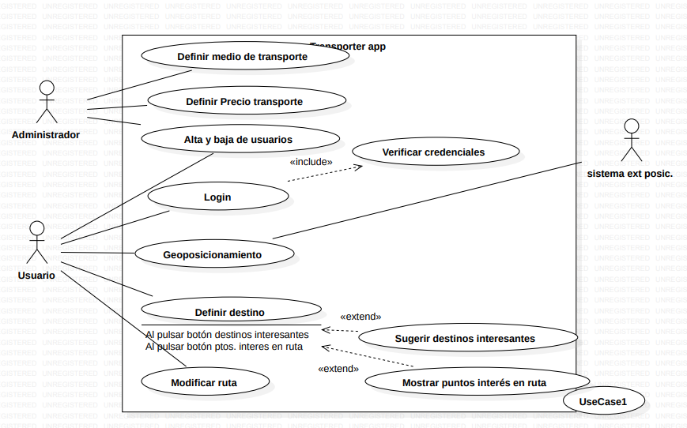

# Casos de Uso (Transport App)

### Actor/Actores

|  Actor | Administrador |
|---|---|
| Descripción  | El administrador es el encargado de gestionar y controlar el funcionamiento de una aplicación en este caso, relacion con el transporte datos además de control de usuarios|
| Características  | Este puede acceder a datos de todo tipo en la aplicación, y modificarlos |
| Relaciones | Este tiene relación con los usuarios, de forma que puede ver el alta y baja de estos en app |
| Referencias | En este diagrama, realiza tres casos en concreto: "Definir medio de transporte", "Definir Precio de transporte" y "Alta y Baja de Usuarios"  |   
|  Notas |  Puede tener un valor muy importante en lo que al control de transporte se refiere |
| Autor  | José Manuel Peña Rodríguez |
|Fecha | 27/01/2024 |

### Casos de Uso

|  Caso de Uso | Definir medio de transporte  |
|---|---|
| Fuentes  | Documento Transport App  |
| Actor  | Administrador |
| Descripción | Permite al Administrador el poder crear u modificar nuevos medios de transporte para su uso  |
| Flujo básico | El administrador entrar en el sistema a traves del inicio de sesión. Introduce los datos del nuevo medio, como nombre, capacidad, etc. Confirma estos datosa añadidos |
| Pre-condiciones | Se necesita que el administrador haya iniciado sesión en el sistema  |  
| Post-condiciones  | Después del incio, quedarán registrados los nuevos datos, quedando definido por completo el medio de transporte  |  
| Requerimientos | Accesos a las funciones administrativas para la modificación del medio de transporte  |
| Notas | No hay notas adicionales  |
| Autor  | José Manuel Peña Rodríguez |
| Fecha | 27/01/2024 |