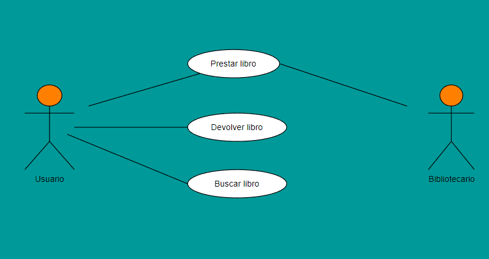

# Casos de Uso (Biblioteca)

### Actor/Actores

|  Actor | Administrador |
|---|---|
| Descripción  | El administrador es el encargado de gestionar y controlar el funcionamiento de una aplicación en este caso, relacion con el transporte datos además de control de usuarios|
| Características  | Este puede acceder a datos de todo tipo en la aplicación, y modificarlos |
| Relaciones | Este tiene relación con los usuarios, de forma que puede ver el alta y baja de estos en app |
| Referencias | En este diagrama, realiza tres casos en concreto: "Definir medio de transporte", "Definir Precio de transporte" y "Alta y Baja de Usuarios"  |   
|  Notas |  Puede tener un valor muy importante en lo que al control de transporte se refiere |
| Autor  | José Manuel Peña Rodríguez |
|Fecha | 27/01/2024 |