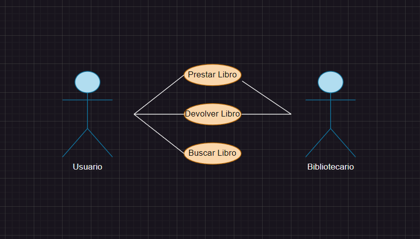

# Casos de Uso (Biblioteca)

### Actor/Actores

|  Actor | Bibliotecario |
|---|---|
| Descripción  | Tiene el poder administrativo para organizar la biblioteca  |
| Características  | Pueden buscar libros que sean pedidos por el Usuario, a traves de ciertos filtros de busqueda, asi como que pueden prestarlos |
| Relaciones | Interactuan con "Prestar Libro", lo cual lo conecta con el Usuario, además de "Devolver Libro".  |
| Referencias | Prestar Libro, Devolver libro (debido a su unión con el Usuario)  |   
|  Notas | Acceso a los datos de la biblioteca  |
| Autor  | José Manuel Peña Rodríguez |
|Fecha | 28/01/2024 |

|  Actor | Usuario |
|---|---|
| Descripción  | Usan el sistema de bibliotecas |
| Características  | Tiene la capacidad de buscar libros en una selección a través de filtros de busqueda, y con la ayuda del biblotecario, seleccionar ese libro y utilizarlo |
| Relaciones | Interactua con las relaciones "Prestar Libro" (unido al bibliotecario), "Devolver Libro" y "Buscar Libro"|
| Referencias | "Prestar Libro", "Devolver Libro" y "Buscar Libro"  |   
|  Notas |  |
| Autor  | José Manuel Peña Rodríguez |
|Fecha | 28/01/2024 |

### Casos de Uso

|  Caso de Uso | Prestar Libro |
|---|---|
| Fuentes | Documento Tarea_Biblioteca |
| Actor | Bibliotecario |
| Descripción | Luego de haber buscado en el sistema, el bibliotecario presta el libro correspondiente  |
| Flujo básico | El Bibliotecario confirma el registro del usuario en el servcio de la biblioteca y luego presta el libro, quedando registrada esta última acción |
| Pre-condiciones | El Usario debe habe buscado el libro y se debe haber comprobado su disponibilidad |  
| Post-condiciones  | El Usario debe ser registrado en la base de datos, como dueño temporal del libro, hasta su devolución a la biblioteca |  
| Requerimientos | Acceso al sistema y al libro en cuestión |
| Notas |   |
| Autor  | José Manuel Peña Rodríguez |
| Fecha | 28/01/2024 |

|  Caso de Uso | Devolver Libro |
|---|---|
| Fuentes | Documento Tarea_Biblioteca |
| Actor | Usuario, Bibliotecario |
| Descripción | El Usuario hace vuelta del libro a la Biblioteca  |
| Flujo básico | El Usuario devuelve el libro usado, y esta devolución queda registrada en la base de datos de de la biblioteca, gracias al propio Bibliotecario |
| Pre-condiciones | Que se revise en la base de datos la disponibilidad del libro |  
| Post-condiciones  | Que el libro este disponible |  
| Requerimientos | Que el libro haya sido buscado en la base de datos para comprobar la disponibilidad del mismo |
| Notas |   |
| Autor  | José Manuel Peña Rodríguez |
| Fecha | 28/01/2024 |

|  Caso de Uso | Buscar Libro |
|---|---|
| Fuentes | Documento Tarea_Biblioteca |
| Actor | Usuario |
| Descripción | Se busca un libro cualqueiera en la web/base de datos de la Biblioteca  |
| Flujo básico | Se accede a la base de datos y se introduce el nombre del libro para comprobar su existencia |
| Pre-condiciones | Que se haya accedido a la web de la Biblioteca  |  
| Post-condiciones  | Que el libro buscado se encuentre en la Biblioteca  |  
| Requerimientos | El libro debe ser devuelto  |
| Notas |   |
| Autor  | José Manuel Peña Rodríguez |
| Fecha | 28/01/2024 |