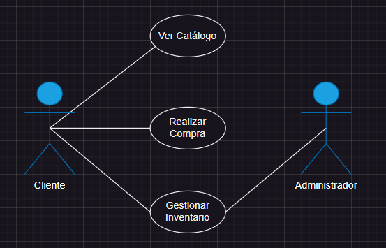

# Casos de Uso (Gestión de Tienda)

### Actor/Actores

|  Actor | Cliente |
|---|---|
| Descripción  | Realiza su compra a través de la web |
| Características | Puede acceder al catálogo asi como a todas las opciones que proporcione el mismo, además de gestionar la compra desde la web |
| Relaciones | "Ver Catálogo", "Realizar Compra", "Gestionar Inventario" |
| Referencias | "Ver Catálogo", "Realizar Compra", "Gestionar Inventario" (esta última se conecta con el Administrados) |   
| Notas | |
| Autor  | José Manuel Peña Rodríguez |
|Fecha | 29/01/2024 |

|  Actor | Administrador |
|---|---|
| Descripción  | Controla todas las características de la tienda |
| Características | Es capaz de acceder a todos los ajustes de la tienda, asi como puede cambiar datos de la misma para agregar/quitar propiedades |
| Relaciones | "Ver Catálogo", "Gestionar Inventario"  |
| Referencias | "Ver Catálogo", "Gestionar Inventario" |   
|  Notas |  |
| Autor  | José Manuel Peña Rodríguez |
|Fecha | 29/01/2024 |

### Casos de Uso

|  Caso de Uso | Ver Catálogo |
|---|---|
| Fuentes | Tarea_Gestión_de_Tienda |
| Actor | Cliente, Administrador |
| Descripción | El Cliente o el Administrador obser va el catálogo y analiza los productos para su posterior selección |
| Flujo básico | Primero el Cliente debe de acceder a la página web, lo cual quedará registrado en el momento en el que use el catálogo. Después de esto, el Administrador registrara los movimiento del usuario en la web |
| Pre-condiciones | El usuario debe habern entrado en la web |  
| Post-condiciones  | Que el Cliente abra el catálogo |  
| Requerimientos | Resgistro de entrada del Cliente |
| Notas | |
| Autor  | José Manuel Peña Rodríguez |
| Fecha | 29/01/2024 |

|  Caso de Uso | Realizar Compra |
|---|---|
| Fuentes | Tarea_Gestión_de_Tienda |
| Actor | Cliente, Administrador|
| Descripción | El Cliente procede a compraer uno o varios productos del catálogo antes mencionado |
| Flujo básico | El Cliente añade los productos que desea al carrito y luego realiza la comrpa de los mismos, y mientras tanto, el Administrador registra los movimientos del usuario en la base de datos |
| Pre-condiciones | Que el Cliente haya guardado sus elecciones en el carrito de la compra |  
| Post-condiciones  | Que el sistema permita la comrpa de los mismos |  
| Requerimientos |  |
| Notas |   |
| Autor  | José Manuel Peña Rodríguez |
| Fecha | 29/01/2024 |

|  Caso de Uso | Gestionar Inventario |
|---|---|
| Fuentes | Tarea_Gestión_de_Tienda |
| Actor | Administrador |
| Descripción | Se controlan todas las acciones que tengan que ver con el inventario |
| Flujo básico | El administrador revisa errores o faltas de objetos en el inventario, y modifica esos datos|
| Pre-condiciones | Que haya algun dato a modificar en el inventario |  
| Post-condiciones  | Que el dato sea modificado |  
| Requerimientos | |
| Notas | |
| Autor  | José Manuel Peña Rodríguez |
| Fecha | 29/01/2024 | 