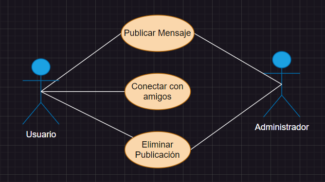

# # Casos de Uso (Red Social)

### Actor/Actores

|  Actor | Usuario |
|---|---|
| Descripción | Es aquel que hace funcion de las utilidades de la redes sociales |
| Características  | Puede hacer uso de todas las características de la aplicación |
| Relaciones | "Publicar Mensaje", "Conectar con amigos", "Eliminar Publicación" |
| Referencias | "Publicar Mensaje", "Conectar con amigos", "Eliminar Publicación" (la cual conecta con el Administrador)|   
| Notas | |
| Autor  | José Manuel Peña Rodríguez |
|Fecha | 01/02/2024 |

|  Actor | Administrador |
|---|---|
| Descripción  | Aquel que controla el correcto funcionamiento de la red social |
| Características  | Es capaz de arreglar errores y modificar la aplicación |
| Relaciones | "Publicar Mensaje", "Eliminar Publicación" |
| Referencias |  "Publicar Mensaje", "Eliminar Publicación" (las cuales se conectan con el Usuario) |   
|  Notas |  |
| Autor  | José Manuel Peña Rodríguez |
|Fecha | 01/02/2024 |

### Casos de Uso

|  Caso de Uso | Publicar Mensaje|
|---|---|
| Fuentes | Tarea_Red_Social |
| Actor | Usuario, Administrador |
| Descripción | Administra la publicación de los mensajes |
| Flujo básico | El Usuario escribe un mensaje el cual envía, llegando a la base de datos, en donde el Administrador procesa si este es valido o no para su publicación, para ser posteriormente publicado|
| Pre-condiciones | Que el Usuario esvriba su mensaje |  
| Post-condiciones  | Que el Administrador lo valide|  
| Requerimientos | Un mensaje correcto |
| Notas | |
| Autor  | José Manuel Peña Rodríguez |
| Fecha | 01/02/2024 |

|  Caso de Uso | Conectar con amigos |
|---|---|
| Fuentes | Tarea_Red_Social |
| Actor | Usuario, Administrador |
| Descripción | La conexión entre uno y demás Usuarios |
| Flujo básico | El Usuario establece conexión con otros Usuarios, y ese registro llega a manos del Administrador en forma de notificación |
| Pre-condiciones | Que el Usuario se conecte |  
| Post-condiciones  | Que el mensaje de entre Usuarios llegue |  
| Requerimientos | |
| Notas |   |
| Autor  | José Manuel Peña Rodríguez |
| Fecha | 01/02/2024 |

|  Caso de Uso | Eliminar Publicación |
|---|---|
| Fuentes | Tarea_Red_Social |
| Actor | Usuario |
| Descripción | El Usuario decide eliminar una publicación |
| Flujo básico | El Usuario solicita eliminar la publicación y la aplicación le otroga la opción de confirmar la opción o no |
| Pre-condiciones | Que el Usuario quiera eliminar la publicación |  
| Post-condiciones  | Que esa publicación se desee eliminar |  
| Requerimientos | |
| Notas | |
| Autor  | José Manuel Peña Rodríguez |
| Fecha | 01/02/2024 | 

