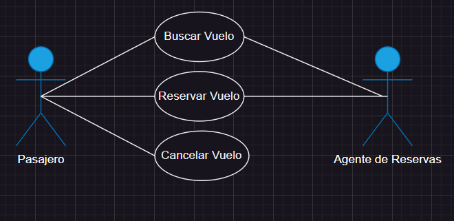

# Casos de Uso (Reserva de Vuelo)

### Actor/Actores

|  Actor | Pasajero |
|---|---|
| Descripción  | Puede ordenar tantos viajes como desee  |
| Características  | Puede buscar entre multiples vuelos en la base de datos, asi como elegir las características que desea para estos (precio, día, etc.) |
| Relaciones | Interactua con "Buscar Vuelo", "Reservar Vuelo" y "Cancelar Vuelo" |
| Referencias | "Buscar Vuelo", "Reservar Vuelo" (debido a su relación directa con el Agente de Reservas) |   
| Notas | Acceso a todos los datos de un viaje |
| Autor  | José Manuel Peña Rodríguez |
|Fecha |01/02/2024 |

|  Actor | Agente de Reservas |
|---|---|
| Descripción  | Es capaz de administar y clasificar vuelos de forma más eficiente que el Pasajero, además de poder hacer contacto directo con actores superiores |
| Características  | Busca en la base de datos de vuelo y revisa todos los datos necesarios, con el fin de poder recomendar con seguridad al Pasajero |
| Relaciones | Interactua con "Buscar Vuelo", "Reservar Vuelo" |
| Referencias | "Buscar Vuelo", "Reservar Vuelo" (debido a la conexión directa con el Pasajero) |   
| Notas |  |
| Autor  | José Manuel Peña Rodríguez |
|Fecha | 01/02/2024 |

### Casos de Uso

|  Caso de Uso | Buscar Vuelo |
|---|---|
| Fuentes | Documento Tarea_Reserva_de_vuelos |
| Actor | Pasajero, Agente de Reservas |
| Descripción | Se hace la busqueda del Vuelo en la base de datos mediante ciertos requisitos previamente seleccionados |
| Flujo básico | El Agente y el Pasajero consultan juntos la base de datos para poder seleccionar un vuelo |
| Pre-condiciones | La revisión y selección del vuelo a través de unos parametros |  
| Post-condiciones | Disposición del vuelo |  
| Requerimientos | Que se haya buscado el vuelo con anterioridad |
| Notas | |
| Autor  | José Manuel Peña Rodríguez |
| Fecha | 14/01/2024 |

|  Caso de Uso | Reservar Vuelo |
|---|---|
| Fuentes | Documento Tarea_Reserva_de_vuelos |
| Actor | Pasajero, Agente de Reservas |
| Descripción | Una vez buscado en la base de datos el vuelo, se procede a jacer la reserva |
| Flujo básico | Se rellenan una serie de datos en la base de datos, con el fin de que el sistema detecte estos datos y hago el cobro del vuelo |
| Pre-condiciones | Que se haya seleccionado y pagado el vuelo |  
| Post-condiciones  | Aceptación de los datos bancarios del Pasajero |  
| Requerimientos | Busqueda con anterioridad del vuelo |
| Notas |   |
| Autor  | José Manuel Peña Rodríguez |
| Fecha | 14/01/2024 |

|  Caso de Uso | Cancelar Vuelo |
|---|---|
| Fuentes | Documento Tarea_Reserva_de_vuelos |
| Actor | Pasajero |
| Descripción | El Pasajero puede tomar la decisión de cancelar el vuelo, debido a cualquier problema externo, lo cual solo puee hacer el debido a que la decisión es suya  |
| Flujo básico | El Pasajero accede a la base de datos y solicita o bien en la página o a traves de un sistema de atención al cliente, la cacnelación del vuelo |
| Pre-condiciones | Que se haya consultado con algún tipo de servicio, la cancelación |  
| Post-condiciones  | Que el vuelo este en el plazo disponible o con los requisitos necesarios para su posterior cancelación  |  
| Requerimientos | Causas de cancelación |
| Notas |   |
| Autor  | José Manuel Peña Rodríguez |
| Fecha | 14/01/2024 | 