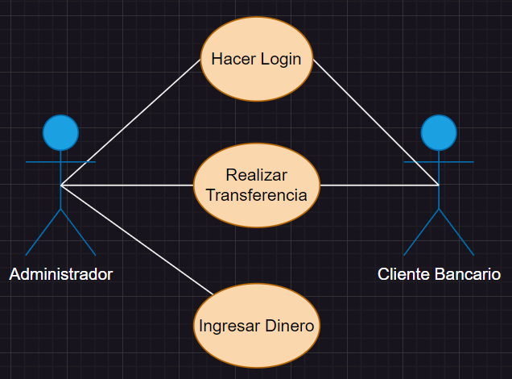

# Casos de Uso (Cajero)

### Actor/Actores

|  Actor | Administrador|
|---|---|
| Descripción  | Aquel que controla el flujo de todas las acciones que se realizan en el cajero |
| Características | Es capaz de controlar cuanta gente utilzia el ATM, asi como las acciones que se realizan en él |
| Relaciones | "Hacer Login", "Realizar Transferencia", "Ingresar Dinero"  |
| Referencias | "Hacer Login", "Realizar Transferencia", "Ingresar Dinero" (se conecta directamente con el Cliente Bancario )  |   
| Notas | Es capaz de poder recibir notificaciones de todas las acciones, más no acceder a ellas|
| Autor  | José Manuel Peña Rodríguez |
|Fecha | 28/01/2024 |

|  Actor | Cliente Bancario |
|---|---|
| Descripción  | Aquel que acude al ATM con el fin de poder realizar acciones desde su cuenta bancaria |
| Características  | Puede realizar  cualquier acción que sea posible para una cuenta de banco|
| Relaciones | "Hacer Login", "Realizar Transferencia", "Ingresar Dinero" |
| Referencias | "Hacer Login", "Realizar Transferencia", "Ingresar Dinero" (se conecta con el Administrador) |   
|  Notas |  |
| Autor  | José Manuel Peña Rodríguez |
|Fecha | 28/01/2024 |

### Casos de Uso

|  Caso de Uso | Hacer Login |
|---|---|
| Fuentes | Tarea_Gestión_Cajero |
| Actor | Cliente Bancario, Administrador |
| Descripción | El proceso que realiza el Usuario para poder |
| Flujo básico | El Cliente accede a través de un usuario y contraseña a la base de datos del cajero, lo cual quedará en el registo que el Administrador podrá ver |
| Pre-condiciones | Que el Cliente introduzca sus datos en el cajero|  
| Post-condiciones | Que el cajero acepte los datos |  
| Requerimientos | |
| Notas | |
| Autor  | José Manuel Peña Rodríguez |
| Fecha | 28/01/2024 |

|  Caso de Uso | Realizar transferencia |
|---|---|
| Fuentes | Tarea_Gestión_Cajero |
| Actor | Cliente Bancario, Administrador |
| Descripción | El proceso de transferencia de dinero en el cajero |
| Flujo básico | Un usuario transfiere a través de la plataforma una serie de dinero hacia otro usuario, lo cual queda registrado en la base de datos  |
| Pre-condiciones | Que se seleccione una cantidad de dinero a transferir |  
| Post-condiciones  | Que el otro Cliente acepte la transferencia|  
| Requerimientos | |
| Notas |  |
| Autor  | José Manuel Peña Rodríguez |
| Fecha | 28/01/2024 |

|  Caso de Uso | Ingresar dinero |
|---|---|
| Fuentes | Tarea_Gestión_Cajero |
| Actor | Cliente Bancario |
| Descripción | El Cliente hace un ingreso de dinero  |
| Flujo básico | El Cliente procede a entrar en su cuenta bancaria con el fin de usar el sistema para poder traspasar una cierta cantidad de dinero |
| Pre-condiciones | Que se haya insertado la cantidad de dinero a ingresar |  
| Post-condiciones  | Que el sistema bancario acepte la transferencia |  
| Requerimientos | |
| Notas | |
| Autor  | José Manuel Peña Rodríguez |
| Fecha | 28/01/2024 | 

